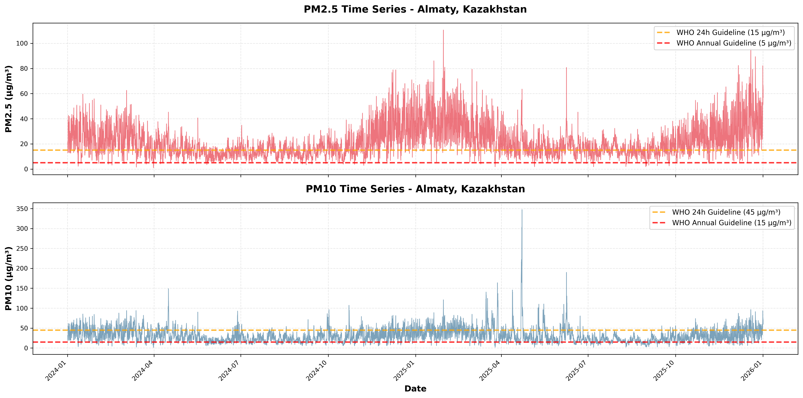
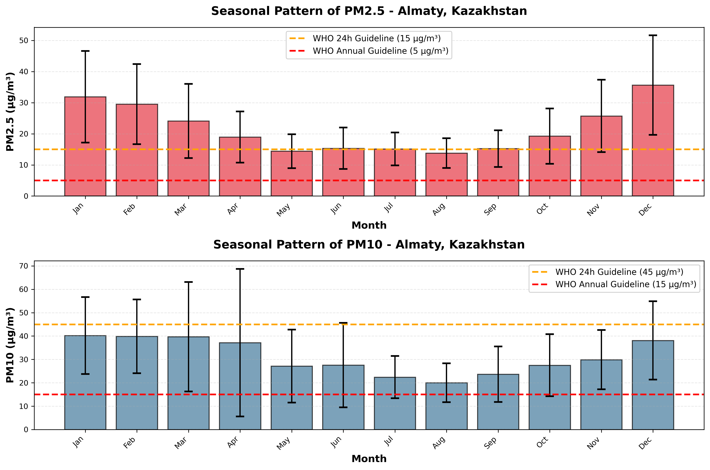
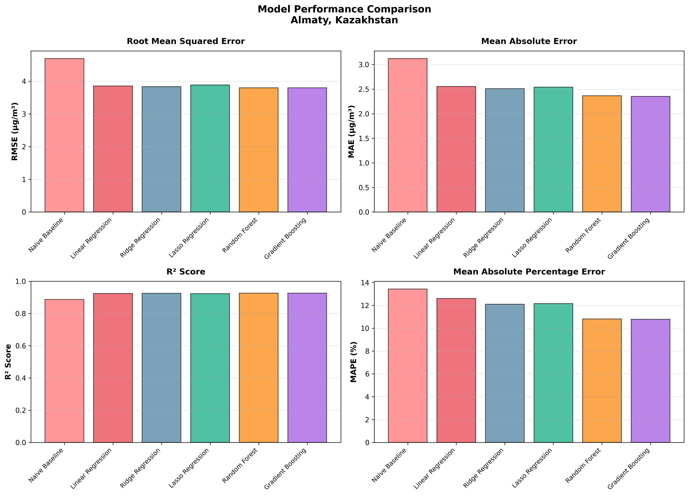
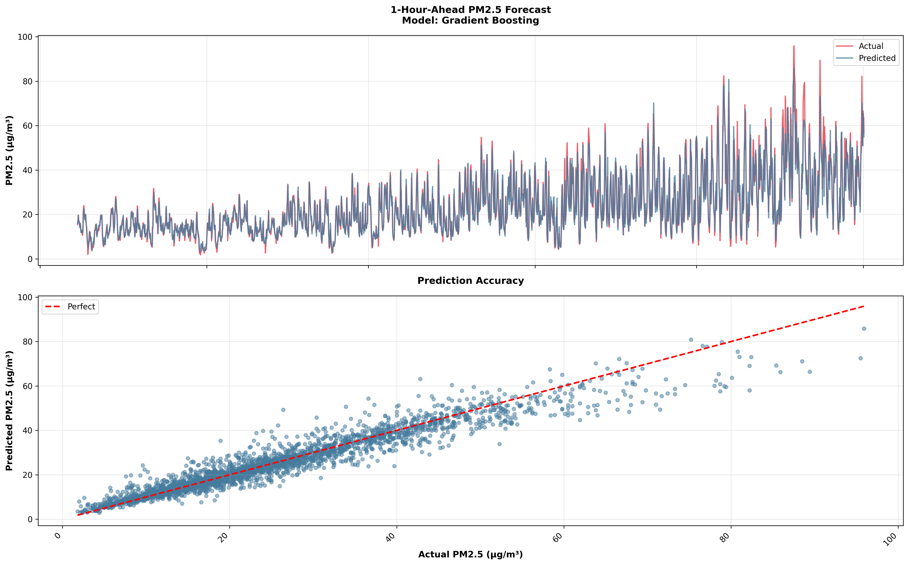
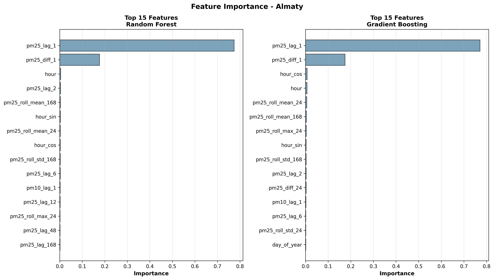

# Almaty Air Quality Forecasting & Analysis

Machine learning project focused on analyzing and forecasting PM2.5 and PM10 air pollution levels in Almaty, Kazakhstan.

This project implements a structured data science pipeline including data acquisition, exploratory analysis, feature engineering, and time series forecasting.

---

## 📍 Project Overview

- **Location:** Almaty, Kazakhstan  
- **Targets:** PM2.5 and PM10 concentrations  
- **Time Horizon:** 2024–2025  
- **Objective:** Short-term air pollution forecasting and pattern analysis  

Air pollution is a significant environmental challenge in Almaty.  
This project aims to model temporal pollution dynamics and build predictive models to support data-driven environmental analysis.

---

## 🔬 Methodology

The workflow follows a research-oriented pipeline:

### 1. Data Collection
- Automated data download
- Structured storage system
- Config-driven parameters

### 2. Exploratory Data Analysis (EDA)
- Distribution analysis
- Correlation analysis
- Seasonal and weekly trends
- Diurnal patterns

### 3. Feature Engineering
- Lag features
- Rolling statistics
- Temporal features

### 4. Modeling
- PM2.5 forecasting model
- PM10 forecasting model
- Model comparison
- Residual diagnostics

---

## 📊 Key Results

### Time Series Overview

### Seasonal Patterns

### Model Comparison (PM2.5)

### Predictions vs Actual (PM2.5)

### Feature Importance

---

## 🗂 Project Structure
almaty_air_research/
│
├── reports/
│ └── figures/ # Final visual results
│
├── src/
│ ├── config.py
│ ├── data_download.py
│ ├── eda.py
│ ├── exploratory_analysis.py
│ ├── modeling_forecast_pm10_t1.py
│ ├── modeling_forecast_pm25_t1.py
│ ├── utils.py
│ └── tests_test_data_download.py
│
├── src/notebooks/ # Research notebooks
├── requirements.txt
├── setup.py
└── README.md

---

## How to Run

### 1. Install dependencies

pip install -r requirements.txt

Run forecasting scripts
python src/modeling_forecast_pm25_t1.py
or
python src/modeling_forecast_pm10_t1.py

3. Optional: Run notebooks

Open Jupyter Notebook and execute notebooks inside src/notebooks/.

🛠 Technologies Used

Python
pandas
NumPy
matplotlib
scikit-learn
statsmodels
Jupyter Notebook

📌 Notes

Raw datasets are not included in this repository.

All figures are reproducible using the provided pipeline.

Configuration parameters are centralized in src/config.py.

👩‍💻 Author
Abdikarim Assem
Eurasian National University (ENU)
Astana, Kazakhstan
